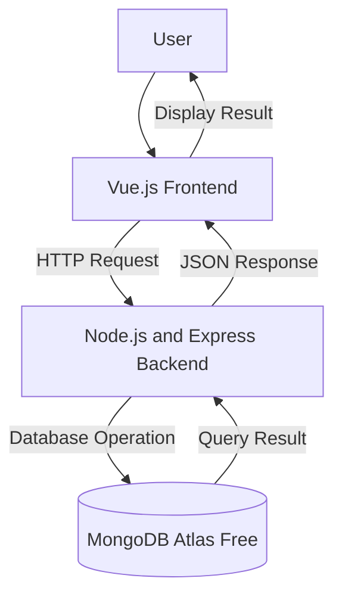

# System Architectural Design

## 1. System Overview
The Inventory Management System is a web-based application that enables businesses and organizations to digitally track and manage their product inventory. It provides a structured platform for recording item details, monitoring stock levels, and generating inventory insights to support efficient supply chain operations.

## 2. Selected Architectural Pattern
The proposed system will use a three-tier client-server architecture.

The system will be divided into:
1. Presentation layer
2. Application layer
3. Data layer

This architecture separates the user interface, business logic, and data management responsibilities, resulting in a more maintainable, scalable, and testable system.

## 3. Architectural Components

### Presentation Layer
The presentation layer will use Vue.js. It will display inventory data, collect user input such as item details and stock adjustments, and send HTTP requests to the backend API. Vue.js components will handle the rendering of item lists, forms, and low-stock alerts.

### Application Layer
The application layer will use Node.js and Express. It will receive HTTP requests from the Vue.js frontend, validate incoming data, apply business logic such as low-stock threshold checks, and communicate with the MongoDB Atlas database. It will expose RESTful API endpoints for all CRUD operations.

### Data Layer
The data layer will use MongoDB Atlas Free. It will store, retrieve, update, and delete inventory records. MongoDB's document-based structure is well-suited for inventory data, which may vary in fields across different product categories.

## 4. Component Responsibilities

| Component | Technology | Responsibility |
|---|---|---|
| User interface | Vue.js | Displays inventory data and collects user input |
| Application server | Node.js and Express | Processes requests, validates data, and applies business logic |
| Database | MongoDB Atlas Free | Stores and manages inventory records |
| Repository | GitHub | Stores documentation and tracks version changes |

## 5. System Architecture Diagram



## 6. Data Flow

### Example Process: Add a New Inventory Item
1. The user fills out the item form in the Vue.js interface, entering the item name, category, quantity, and unit price.
2. Vue.js validates that all required fields are filled before submission.
3. The frontend sends an HTTP POST request to the Express backend API endpoint.
4. The backend validates the incoming data and checks for duplicate item names.
5. The backend sends an insert operation to MongoDB Atlas.
6. MongoDB stores the new inventory item as a document in the items collection.
7. MongoDB returns a success result to the backend.
8. The backend sends a JSON response with the newly created item to the frontend.
9. The frontend displays a confirmation message and updates the inventory list.

## 7. Database Plan

### Proposed Database Name
```text
inventory_db
```

### Primary Collection
```text
items
```

### Proposed Fields

| Field | Type | Description |
|---|---|---|
| _id | ObjectId | Unique identifier automatically assigned by MongoDB |
| name | String | Name of the inventory item |
| category | String | Category or classification of the item |
| quantity | Number | Current stock quantity of the item |
| unit | String | Unit of measurement (e.g., pieces, boxes, kg) |
| unitPrice | Number | Price per unit of the item |
| reorderLevel | Number | Minimum quantity before a low-stock alert is triggered |
| status | String | Current stock status (e.g., In Stock, Low Stock, Out of Stock) |
| createdAt | Date | Date and time the record was created |
| updatedAt | Date | Date and time the record was last updated |

## 8. Design Justification
The three-tier architecture is appropriate for the Inventory Management System because it cleanly separates the concerns of user interface, business logic, and data storage. This separation allows the frontend, backend, and database to be developed, tested, and updated independently, reducing the risk of one layer's changes breaking another. From a security perspective, the backend acts as a controlled gateway between the user interface and the database, ensuring that raw database access is never exposed directly to the client. This structure also makes the system easier to scale and extend in future modules, such as adding user authentication or additional reporting features in Module 7.

## 9. Architectural Limitations
The current activity focuses only on the proposed architecture. Frontend code, backend code, database connection, user authentication, and deployment have not yet been implemented. These components will be developed in Module 7.